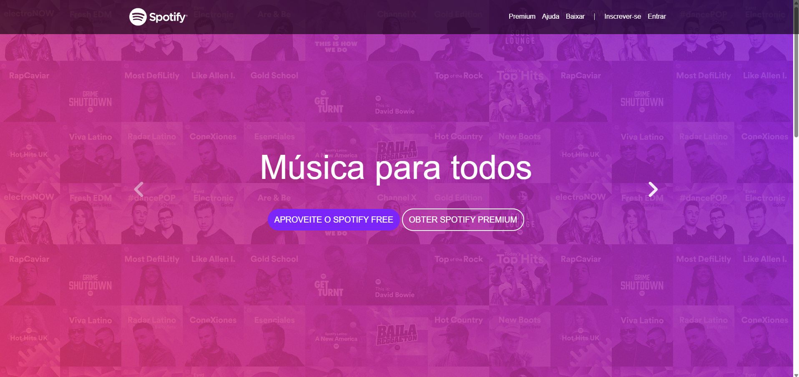

# 🎧 Projeto Spotify Clone

Este é um projeto front-end criado durante um curso da Udemy, com o objetivo de replicar o layout e a experiência visual do site do Spotify.

## 🚀 Tecnologias utilizadas

- HTML5
- CSS3
- Bootstrap 5

## 🎯 Objetivo do projeto

O objetivo principal foi praticar a construção de layouts modernos e responsivos utilizando o framework Bootstrap. O foco está na estrutura visual, sem funcionalidades de backend ou JavaScript dinâmico.

## 📚 Base do projeto

Este projeto foi desenvolvido como parte de um curso da plataforma Udemy (Desenvolvimento Web Completo - Jamilton Damasceno). Alguns elementos visuais foram inspirados diretamente no design oficial do Spotify.

## 🖼️ Prévia

